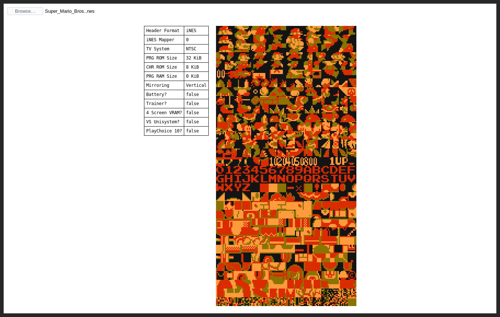

# Orex

Orex will be a web-based NES CHR ROM pattern table viewer and editor. Currently, it is only a viewer. There are a few limitations:

* Orex can only display CHR ROM, not CHR RAM.
* Orex cannot display pattern tables for NES files that have no CHR ROM, but it still prints out useful info from the file header.
* Orex is currently an ugly mess that I wrote in one evening; It ~~will improve quickly~~ may improve one day.
* A four-color palette is used for practical and aesthetic reasons, but no specific hues are read from, or written to, the CHR ROM.

## Screenshot

